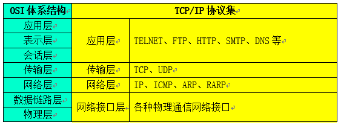
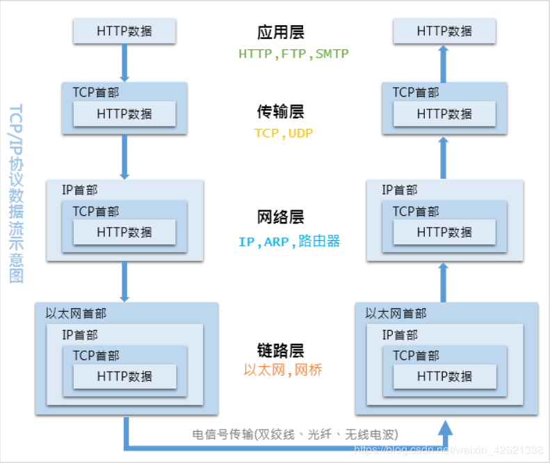
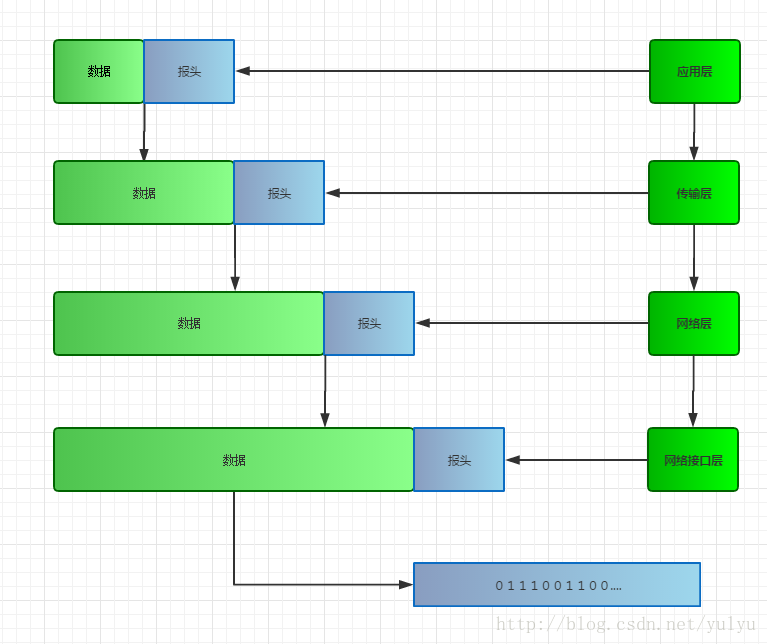
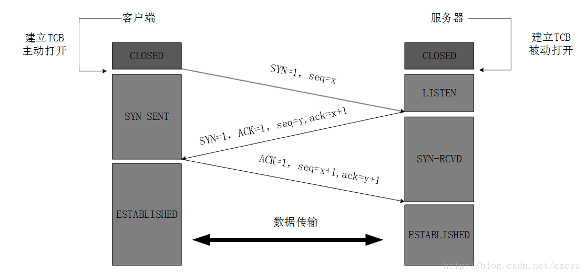
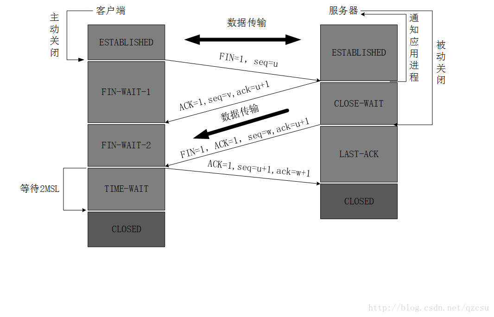

# TCP协议

## 特点

* 面向连接
* TCP协议采用发送应答机制
* TCP协议采用超时重传机制
* TCP协议还会将接收到的TCP报文段重排、整理、再交付给应用层

## TCP和IP

## 数据传输

## TCP数据包

> TCP的报头占空间，TCP需要将数据拆包和组合

## 运行在TCP协议上的协议

1. HTTP（Hypertext Transfer Protocol，超文本传输协议），主要用于普通浏览。

2. HTTPS（Hypertext Transfer Protocol over Secure Socket Layer, or HTTP over SSL，安全超文本传输协议,HTTP协议的安全版本。

3. FTP（File Transfer Protocol，文件传输协议），由名知义，用于文件传输。

4. POP3（Post Office Protocol, version 3，邮局协议），收邮件用。

5. SMTP（Simple Mail Transfer Protocol，简单邮件传输协议），用来发送电子邮件。

6. TELNET（Teletype over the Network，网络电传），通过一个终端（terminal）登陆到网络。

7. SSH（Secure Shell，用于替代安全性差的TELNET），用于加密安全登陆用。

## 运行在UDP协议上的协议

1. BOOTP（Boot Protocol，启动协议），应用于无盘设备。

2. NTP（Network Time Protocol，网络时间协议），用于网络同步。

3. DHCP（Dynamic Host Configuration Protocol，动态主机配置协议），动态配置IP地址。

## TCP的三次握手

> 确保连接建立

## TCP的四次挥手

> 确保双方都断开连接，释放资源

