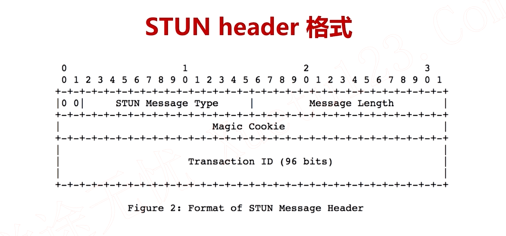

# WebRTC协议

## STUN协议

* STUN存在的目的是进行NAT穿越
* 客户端STUN用户P2P通讯，服务端STUN用于身份验证

## STUN数据包

> STUN Message Type
> STUN Message Length
> Magic Cookies
> STUN Message Body

## ICE

* 交互连接建立，需要两端进行交互才能创建连接

> ICE Candidate 可以进行连接的地址
> 包括协议,IP,端口,和类型
> 主机候选者
> 反射候选者
> 中继候选者

## 收集Candidate

> Host Candidate:本机所有IP和指定端口
> Reflexive Candidate: STUN/TURN
> Relay Candidate: TURN

## DTLS协议

> 加密与解密的基本概念

1. 单向加密
2. 双向加密，包括单向加密和双向加密

### 单向加密

> 同一个秘钥加解密

### 双向加密

> 公钥加密私钥解密，私钥加密公钥解密

### 数字证书

> https证书与ssl/tsl加密,在传输层进行加密

## OpenSSL

> ssl和tsl，握手协议
